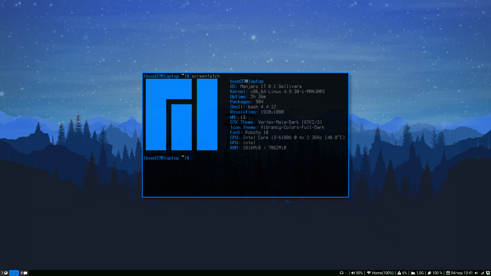

# Dotfiles

## Description
Dotfiles. Arch i3.

## Screenshot
| Clean workspace | Lockscreen |
| --- | --- |
|  |  |

## Dependencies
To run all this configuration files you need the following:
* i3-gaps
* i3blocks
* i3lock-color-git
* compton
* termite
* dmenu
* dunst
* feh

Fonts:
* Source Sans Pro
* Font Awesome
* Input

Other:
* GTK2/3: Arc-Grey-Dark
* Icons: Papirus-Dark
